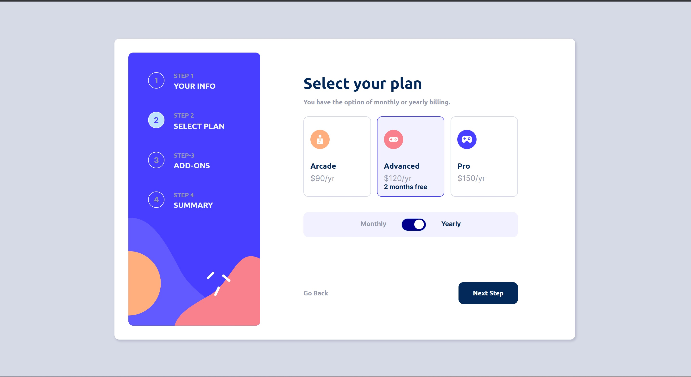
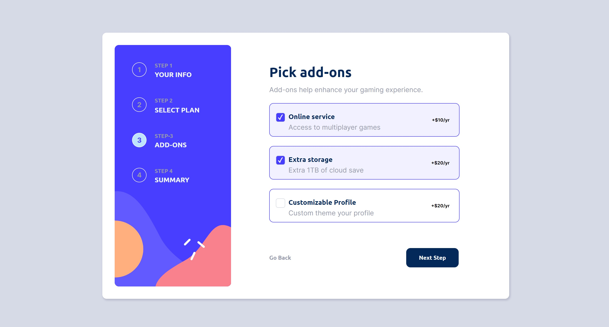
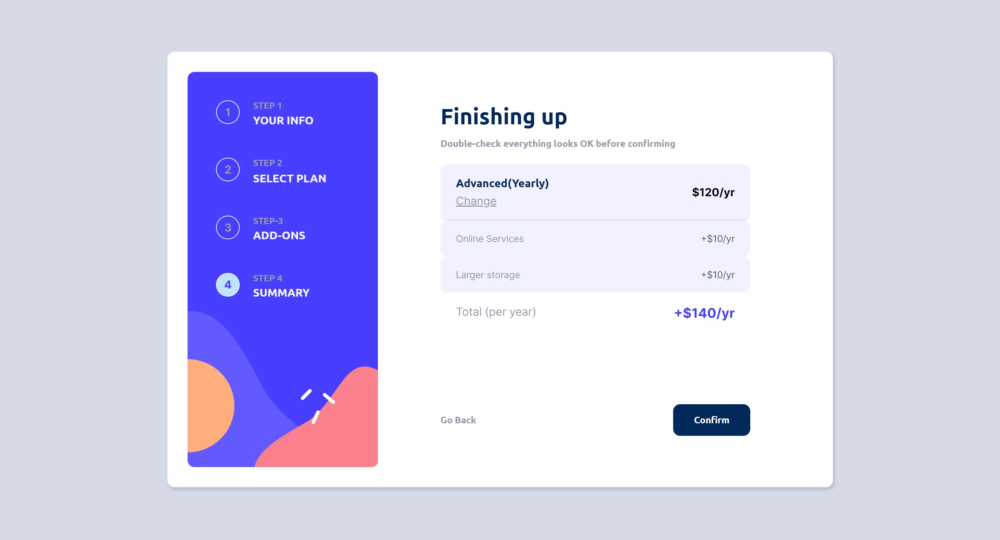
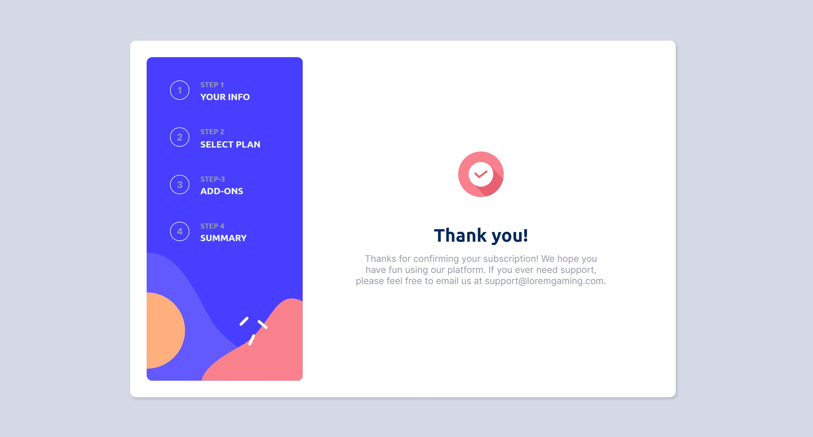
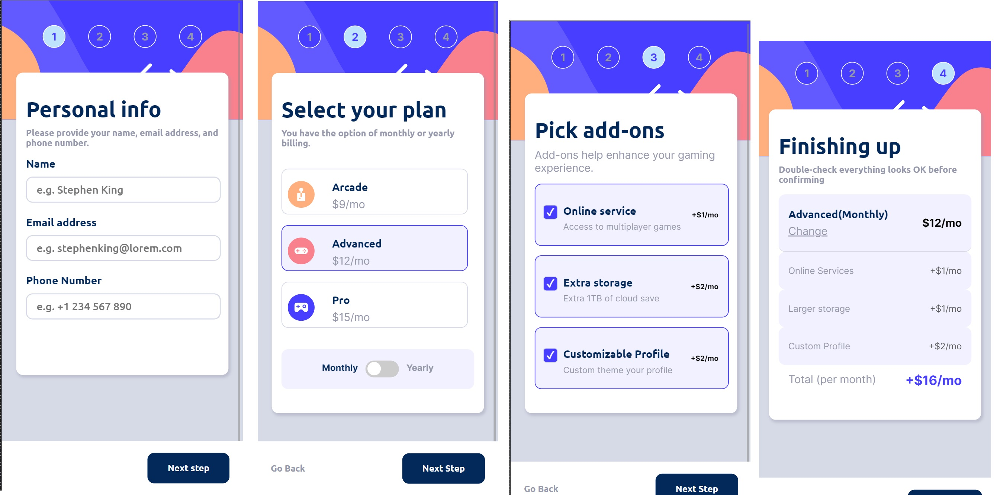

# Multi-step Form 
Challenge by frontend mentor created in next.js using React.

## Table of content
- [Description and usage](#description-and-usage)
- [Installation](#installation)
- [My challenges](#challenges)
- [Authors](#authors)
## Description an usage
One page application that collects users data and creates positive experience  while filling the form.
On first page requiers user to input name, email and telephone number and throws error message when fields left empty or with incorrect input.
On the second page user selects the plan and picks a period using switch slide button.
Next step focuses on picking the add-ons to users plan and is followed by summary page where final price is calculated on screen

## Installation
If you would like to add or improve our website, simply download our repository and run NPM install.

## Screenshots
### For desktop
- 
- 
- 
- 
/ - 
### Mobile view
- 

## My challenges
I found this project challenging and I am grateful that I decided to try. 
Firstly I did struggle with understanding how to correctly pass form data to the parent element, and then ran into trouble once more realizing next.js needs a special conditioning when setting local storage.
I did use help when setting custom checkboxes , found that to be a tough one as well.
Other than then I did my best to achieve desired design and believe I was rather successful.

## Author

- [Frantiska Rechkova](https://github.com/FrantiskaAli)
- [My frontend mentor](https://www.frontendmentor.io/profile/FrantiskaAli)